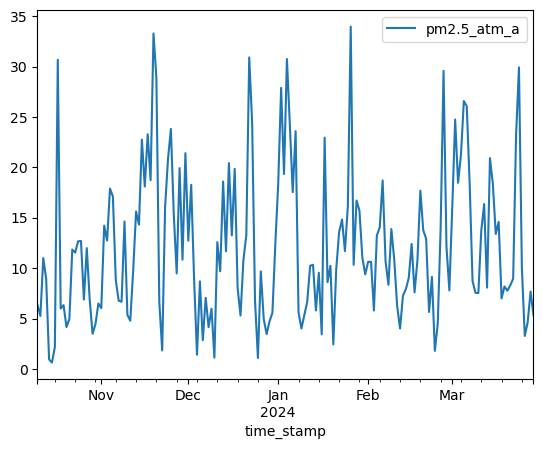
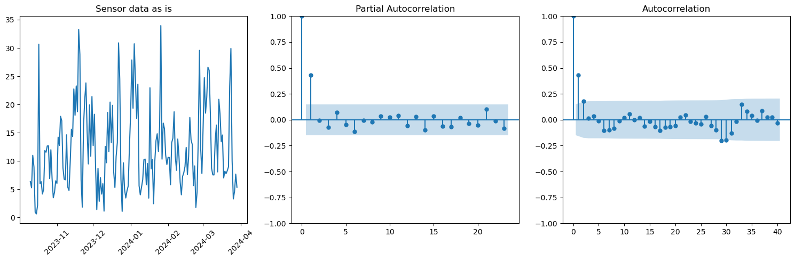
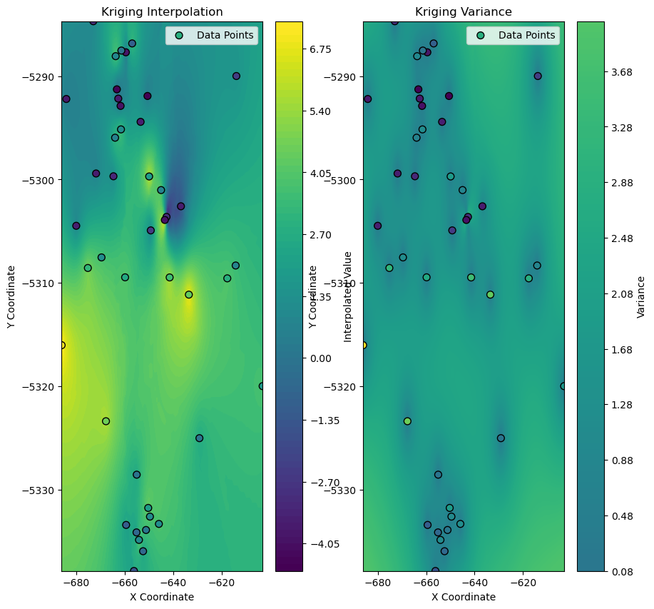

# Air Quality: Machine learning models applied to air quality data

In this project, I have attempted to construct a predictive model for air-quality monitoring.
The particulate data (PM2.5) were obtained from from inexpensive air-sensors by PurpleAir in Dallas Metropolitan area for the time period of (2022-04-01 to 2024-03-29).
Various meteorological data were obtained from [NOAA](https://www.noaa.gov)

## Motivation:

Air pollution data collected by the low-cost sensors are more useful in
applications including research, policy-making, public warnings, and
community education. Mostly because they have a denser presence
especially in urban areas. For example [PurpleAir](https://www2.purpleair.com/) has a global network of
over 13000 sensors.
While they tend to be less accurate, EPA has recently published a
correction schemes [1](https://doi.org/10.3390%2Fs22249669) to improve the comparability of these sensors data.
These kinds of low-cost sensors fills the spatial and temporal gaps in air-
quality detection and provides valuable information that is easily accessible to public.

## Data Question

Can we use machine learning models to make reasonable air quality predictions
based on air-quality data from low-cost sensors along with other relevant
meteorological data (Rain, Snow, Wind, Temperature, Season, smoke
events, etc)?

Can we use neural networks as yet another method of learning to predict from such data?

## Collect data

[PurpleAir API](https://api.purpleair.com/) provides an excellent source of real time as well as historical sensor data. The following notebook [purpleair_api.ipynb](notebooks/purpleair_api.ipynb) gets the list of sensors in a geographical area defined by a bounding box and then gets historical data for requested dates. Shout out to this awesome code for API call [zfarooqi](https://github.com/zfarooqui/py_purpleair_aqi/tree/main) for helping me get started with this.

The airquality data was then loaded into sqlite for easy querying and analysis. 

The weather data were downloaded from [NOAA](https://noaa.gov) for the needed dates and region. Since the region of our data is not so large, we did not see large variations in the weather data within the sensors of the region. So, weather data from a single meteorological sensor is used for analysis. 

## Preliminary EDA and thoughts

A quick look at the time-series data of a chosen sensor shows that the data is quite noisy with significant day to day variations. 

### Time series Forecasting

#### Stationary?

ADF test is used to determine the presence of a unit root in a time series data and helps understand if the series is stationary or not.

Null Hypothesis: The series is non-stationary. 
Based on the result obtained for qute a few randomly chosen sensors: Here's result for one such instance

Results of Dickey-Fuller Test:

| Metric                        | Value          |
|-------------------------------|----------------|
| Test Statistic                | -8.192365e+00  |
| p-value                       | 7.607350e-13   |
| #Lags Used                    | 0.000000e+00   |
| Number of Observations Used   | 171.000000e+02 |
| Critical Value (1%)           | -3.469181e+00  |
| Critical Value (5%)           | -2.878595e+00  |
| Critical Value (10%)          | -2.575863e+00  |

The p-value is extremely low. Evidence for time series being stationary. 

#### ARMA model?

A quick look at the correlation in the time series data in the Figure below:  

Both PACF and ACF plots show a lag of 1. A lag of 1 in PACF suggests that the future value is mostly determined by value one step behind in the time series (which is a day here). So a AR(1) model is appropriate.

While the lag of 1 in ACF is related to how the errors in the measurements today affects the measurements tomorrow. Hence a MA(1) becomes appropriate. 

With these results, We proceed with an ARIMA model with (1 0 1). We used SARIMAX from statsmodels, which includes in addition to the AR and MA, seasonality as well as exogenous variables from the data. The ARIMA implementation can be found [here](notebooks/arima.py) 

#### Caviats?

Time series forecasting ignores the spatial dependence of the air quality data. The measurements of particulates in air is a local variable. Hence, it's prediction should include the information of the geo-location of the sensor in question

### Tree-based Regression Methods:

We will approach this in two ways:

- A temporal regression [temporal.py](notebooks/temporal.py):

    -- Tree based regression with features that correspond to a time series.

    a. A lag feature was created for each sensor based on data of the day before. (.shift() method of pandas dataframes are handy)

    b. XGBOOST is the choice of regression and produced the best results. The train-test split is performed ahead of time based on time series indexing which prevents data leakage. 

- A spatial regression [spatial.py](notebooks/spatial.py):

    -- Tree based regression with features that capture spatial correlation

    a. To generate spatial features, a weight matrix is generated based on inverse distance. Essentially, closer sensors are given larger weights. 

    b. Again XGBOOST regressor is used. The model was trained on all the sensors except the one. This was done for all the sensors. These were separate instances of the model. Hence, we do not expect data leakage to occur. 

- Ensemble

    -- Finally a simple ensemble (prediction averaged of the spatial and temporal) was constructed.

### Neural network

In order to capture both the spatial and time-series nature of the data, we are implementing a 3D convolutional neural network. A group of images (sequential in time) are stacked and fed into a convolutional neural network. An output is generated which is then compared (MSELoss) against the next image in sequence.

The data is a single channel (value of pm2.5) image of some dimensions. These data are stacked in timesteps of 10.

The deep network consists of block with 3D convolution, ReLU layers, batch normalization and skip connections to prevent gradient loss. The model is designed such that the image dimension is unchanged for prediction. (upconvolutions to the rescue)

The data loading and training is presented here [train](notebooks/train_cnn.py). 

- Data generation:
  - First a spherical earth is assumed and the latitude and longitude are converted into cartesian coordinates. The x and y coordinates are then taken to flatten the space. No projections done. 
  - Because the sensor locations are sparse with large areas unsampled, Kriging interpolations were performed based on a spherical Variogram model. Here's a sample interpolated image for some point in time.  The regions away from the data points generally have values closer to mean and larger variances. 
- Once the images are generated, we can feed into the neural network, optimize the hyperparamters and train the model. 

