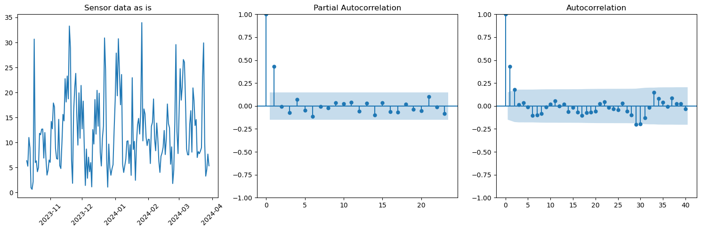
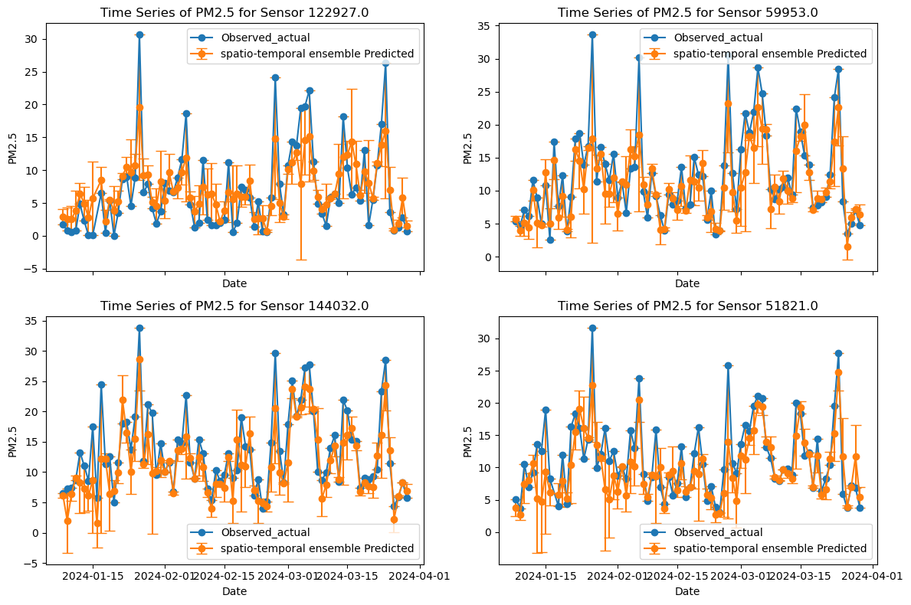
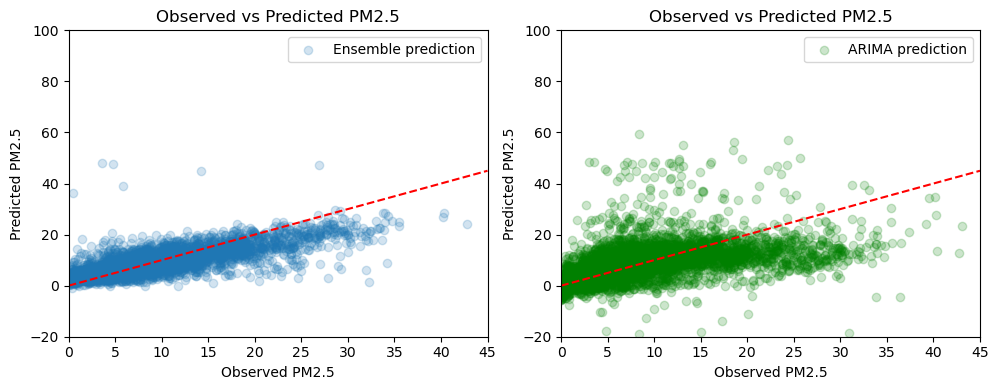
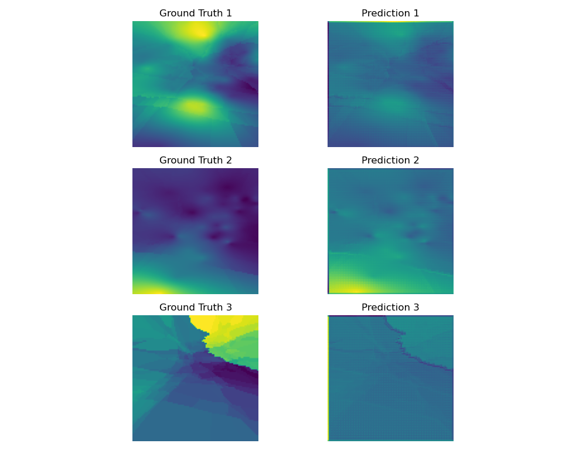

# Air Quality: Machine learning models applied to air quality data

In this project, I have attempted to construct a predictive model for air-quality monitoring.
The particulate data (PM2.5) were obtained from the [OpenAQ](https://openaq.org) API for sensors in the Philadelphia Metropolitan area.
Various meteorological data were obtained from [NOAA](https://www.noaa.gov)

## Motivation

Air pollution data collected by the low-cost sensors are more useful in
applications including research, policy-making, public warnings, and
community education. Mostly because they have a denser presence
especially in urban areas. For example [PurpleAir](https://www2.purpleair.com/) has a global network of
over 13000 sensors.
While they tend to be less accurate, EPA has recently published a
correction schemes [1](https://doi.org/10.3390%2Fs22249669) to improve the comparability of these sensors data.
These kinds of low-cost sensors fills the spatial and temporal gaps in air-quality detection and provides valuable information that is easily accessible to public.

## Data Question

Can we use machine learning models to make reasonable air quality predictions
based on air-quality data from low-cost sensors along with other relevant
meteorological data (Rain, Snow, Wind, Temperature, Season, smoke
events, etc)?

Can we use neural networks as yet another method of learning to predict from such data?

## Collect data

The [OpenAQ v3 API](https://api.openaq.org/v3) is the primary data source, fetching PM2.5 sensor locations and daily/hourly measurements via `src/ingestion/get_openaq.py`. A free API key from [OpenAQ](https://explore.openaq.org/register) is required.

All sensor data is stored in **DuckDB** for efficient querying and analysis, replacing the earlier SQLite approach.

The weather data were downloaded from [NOAA](https://noaa.gov) via `src/ingestion/get_weather.py` for the needed dates and region. Since the region of our data is not so large, we did not see large variations in the weather data within the sensors of the region. So, weather data from a single meteorological station is used for analysis.

## Preliminary EDA and thoughts

A quick look at the time-series data of a chosen sensor shows that the data is quite noisy with significant day-to-day variations. An EMA (exponential moving average, span=7) is applied per sensor before model training to reduce measurement noise while preserving the underlying trend.

Notable features in the data:

- The **June 2023 Canadian wildfire smoke event** produced a spike of ~130 µg/m³, approximately 6–8× the typical daily value. This extreme event distorts ACF estimates and creates a long-tailed residual distribution.
- There is a mild **annual cycle** visible in the data (higher winter PM2.5 from heating and atmospheric inversions).

### Time series Forecasting

#### Stationary?

ADF test is used to determine the presence of a unit root in a time series data and helps understand if the series is stationary or not.

Null Hypothesis: The series is non-stationary.
Based on the result obtained for quite a few randomly chosen sensors, the p-value is extremely low (< 1e-12), providing strong evidence that the series is stationary.

#### ARMA model?

A quick look at the correlation in the time series data in the Figure below:



The **PACF shows a sharp cutoff after lag 1** (~0.92 partial autocorrelation), indicating that an AR(1) component dominates — tomorrow's PM2.5 is primarily determined by today's value.

The **ACF decays slowly** (significant through ~lag 40), consistent with a high-persistence AR(1) process rather than an MA(1). This also shows a subtle uptick around lags 30–35, hinting at an annual seasonal component.

With these results, we proceed with SARIMAX(1, 0, 1) per sensor, using NOAA weather covariates as exogenous variables. The [ARIMA implementation](src/models/arima.py) is in `src/models/arima.py`.

#### Caveat of ARIMA model:

Time series forecasting ignores the spatial dependence of the air quality data. The measurements of particulates in air is a local variable. Hence, its prediction should include the information of the geo-location of the sensor in question.

### Tree-based Regression Methods

We approach this in two ways:

**Temporal regression** ([temporal.py](src/models/temporal.py)):

- Per-sensor XGBoost trained on a rich feature set derived from the sensor's own history.
- Lag features capture autocorrelation: `pm25_lag1`, `pm25_lag7`, `pm25_lag14`, `pm25_lag30`, and `pm25_lag365` (same day last year — captures the annual heating/cooling cycle). A 7-day rolling mean (`pm25_roll7`) and 7-day rolling standard deviation (`pm25_roll7_std`) add trend and volatility context.
- Calendar features (`month`, `week_of_year`, `day_of_week`) encode seasonal and weekday patterns.
- NOAA weather covariates (wind speed, precipitation, temperature, snow, etc.) are joined per date.
- Train/test split is time-indexed (no shuffle) to prevent leakage. No `StandardScaler` — XGBoost is scale-invariant.

**Spatial regression** ([spatial.py](src/models/spatial.py)):

- Leave-one-out by sensor: one XGBoost model per sensor, trained on all other sensors' data across the training period.
- The key feature is the **spatial lag** — an inverse-distance weighted sum of neighboring sensor readings, computed efficiently via a single matrix multiply across all dates (`dates × sensors @ weights.T`).
- EMA smoothing (span=7) is applied before the spatial lag computation to reduce noise propagation through the weight matrix.

**Ensemble** ([ensemble.py](src/evaluation/ensemble.py)):

- OLS-weighted combination of temporal and spatial predictions with a non-negativity constraint (`positive=True`, no intercept). Weights are learned from the full test period.
- Both tree models tend to underestimate extreme PM2.5 values (a known bias of tree ensembles). The OLS ensemble partially mitigates this by reweighting toward whichever model handles extremes better for each sensor.






### 3D CNN (Alternative)

A 3D convolutional neural network ([cnn_model.py](src/models/cnn_model.py), [train_cnn.py](src/models/train_cnn.py)) was implemented as an early approach to capture both spatial and temporal structure. Because the sensors are sparsely located, Kriging interpolation ([spatial_interpolation.py](src/preprocessing/spatial_interpolation.py)) is first applied to produce continuous 100×100 grids, which are then stacked into `(batch, 1, 10, H, W)` tensors.

The network uses 3D Conv blocks with skip connections, batch normalization, and transposed convolutions to preserve spatial dimensions. While it produces plausible outputs, this approach has a fundamental limitation: the Kriging grid is mostly synthetic (interpolated) pixels rather than real sensor readings. The GNN below addresses this.



### Spatio-Temporal Graph Neural Network (Primary)

The primary neural network model is `STGNN` ([gnn_model.py](src/models/gnn_model.py), [train_gnn.py](src/models/train_gnn.py)). It operates directly on the real sensor graph — no interpolation required.

**Architecture:**

- **Graph Attention Network (GATConv, `edge_dim=1`)** applied independently at each timestep for spatial message-passing. Inverse-distance edge weights are passed as edge attributes, biasing attention toward closer sensors.
- **LayerNorm** applied to GAT outputs before the recurrent stage to stabilise activation scale.
- **Stacked GRU (2 layers)** unrolled across T timesteps to learn temporal dynamics.
- A linear output head producing the next **H=3 days** of PM2.5 per sensor node.

**Inputs** (`[T=7, N, F=12]`):

| Feature indices | Source |
| --- | --- |
| 0 | PM2.5 (EMA-smoothed span=7, forward-filled per sensor) |
| 1–3 | PM2.5 lags: t−2, t−7, t−14 (explicit autocorrelation signal) |
| 4–7 | NOAA weather: AWND, TMAX, TMIN, PRCP (broadcast to all nodes) |
| 8–11 | Calendar: sin/cos day-of-week, sin/cos month (cyclical encoding) |

**Sensor graph** ([build_graph.py](src/preprocessing/build_graph.py)):

Built once from lat/lon coordinates using k-NN (k=5, haversine distance via `ball_tree`). Edges are **bidirectional** with inverse-distance weights normalised to [0, 1]. Haversine is used instead of Euclidean to avoid ~25% East-West distortion on raw degree coordinates.

**Training** ([train_gnn.py](src/models/train_gnn.py)):

- Three-way split: train / val (60 days) / test (60 days). Z-score stats computed from training only; saved to `datasets/gnn_norm_stats.npz`.
- AdamW + `ReduceLROnPlateau` (patience=5, factor=0.5). Early stopping at patience=10. Gradient clipping at 1.0.
- Persistence baseline (predict last known value for all 3 horizon steps) logged before training as a sanity check.
- Per-horizon RMSE reported at test time (Day+1, Day+2, Day+3 separately).

**Hyperparameter tuning** ([tune_gnn.py](src/models/tune_gnn.py)):

Optuna TPE sampler with `MedianPruner`. Searches over: `lr`, `hidden`, `heads`, `dropout`, `window`, `k`, `batch_size`, `gru_layers`. Best params saved to `datasets/gnn_best_params.json`.

```
uv run python -m src.models.tune_gnn
uv run python -m src.models.train_gnn
```

| | 3D CNN | STGNN |
| --- | --- | --- |
| Input | Kriging-interpolated 100×100 grids | Raw sensor readings |
| Spatial model | Translational conv | Learned per-edge attention (GAT) |
| Temporal model | 3D conv (non-causal) | Stacked GRU (causal) |
| Prediction horizon | Next frame | Next 3 days |
| Preprocessing | Kriging — hours | k-NN graph — seconds |
